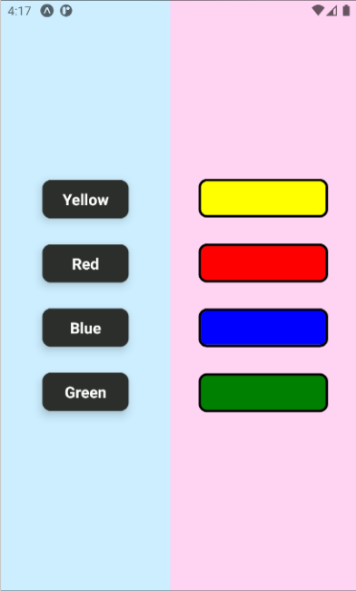

# First exercise for Hybrid mobile Applications module

&nbsp;

    

&nbsp;
&nbsp;

#### Requirements:

1. Use flexbox to change the layout of the elements.
2. Write methods which would change box colors on button press.
3. Write methods which return the original color of the box when the button was pressed again.
